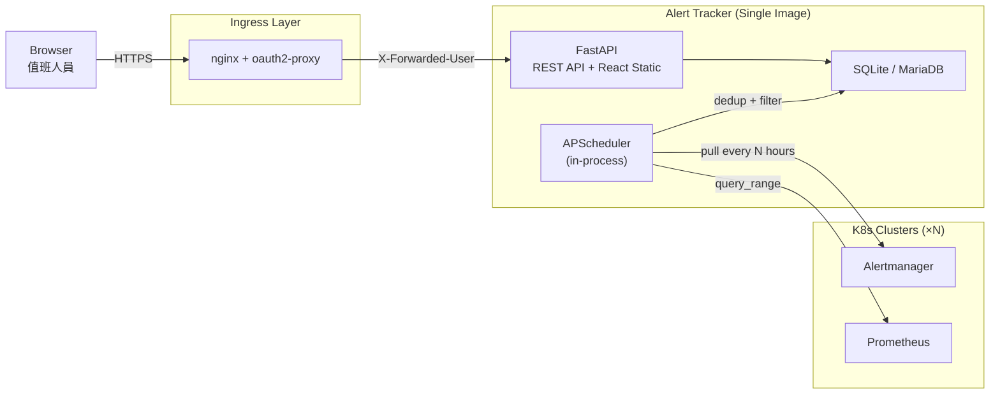

# SRE Alert Tracking System

> 團隊內部值班 Alert 追蹤紀錄系統 v1.1.1 — 自動拉取多座 K8s cluster 的 alert，值班人員填寫處理紀錄，週報管理、趨勢分析、匯出。

---

## 痛點與解決方案

### Alert 風暴下的人工紀錄負擔

**❌ 現狀痛點：**
Alert 風暴發生時，值班人員一邊救火一邊手動統計 alert 發生紀錄。事後依賴大腦回憶填寫報表，漏填、錯填頻繁發生。跨 cluster 的 alert 散落各 Alertmanager，無統一視圖。處理紀錄無結構化格式，難以回溯改善。

**✅ 本系統方案：**
自動從每座 cluster 的 Alertmanager + Prometheus 定時拉取 alert，fingerprint 去重收斂，按週/日自動分群。值班人員只需填寫「現象/影響/處理作法」三個欄位。自訂 label 標記系列性問題，跨週查詢追蹤改善進度。

### 多 Cluster 資料分散

**❌ 現狀痛點：**
多座 Kubernetes cluster 各自有 Prometheus/Alertmanager，查看 alert 需逐一登入各環境。統計時手動彙整，費時且易遺漏。

**✅ 本系統方案：**
`clusters.yaml` 集中管理所有 cluster endpoint，系統自動拉取並標記 alert 來源。前端統一視圖，按 cluster 篩選。每次拉取自動做 health check，endpoint 異常即時顯示。

---

## 核心功能

| 功能 | 說明 |
|------|------|
| **Alert 自動拉取** | 雙引擎：Alertmanager API (當前) + Prometheus query_range (歷史補充)，可設定 4/6/8h 間隔 |
| **Fingerprint 收斂** | 同週期同 alert 只一筆紀錄，更新次數與最後發生時間 |
| **黑白名單過濾** | 按 alertname / group / severity 設定 whitelist 或 blacklist |
| **週報框架** | 每週一自動生成，按日分群，動態 checkbox 任務 |
| **處理紀錄** | 自動帶入 alert 基本資訊（可逃生門覆寫）+ 人工填寫現象/影響/處理作法 |
| **自訂 Label** | Autocomplete 標籤系統，管理員可合併標準化 |
| **歷史查詢** | 按 label / cluster / severity / 周次 / 日期範圍 跨週篩選 |
| **趨勢儀表板** | 每週 alert 數量折線、Top-N 排行、維護窗口標註 |
| **匯出** | 瀏覽器列印 PDF + CSV/JSON/Markdown API 下載（單週或跨週篩選結果） |
| **Annotation 自動映射** | Poller 自動從 annotations 填入「現象」與「影響」，值班人員可覆寫 |
| **時區支援** | `AT_DISPLAY_TIMEZONE` 設定介面時區，週報交接日期自動對應 |
| **Runbook 自動解析** | 從 alert annotations 提取 `runbook_url`，前端直接連結 |
| **維護窗口** | 手動標註維護期間，統計可排除 |
| **資料保留** | 半年/一年可選，排程 + 手動 purge |

---

## 架構總覽



---

## 技術棧

| 層 | 技術 | 說明 |
|----|------|------|
| Frontend | React + TailwindCSS v4 + Vite | 由 FastAPI StaticFiles serve |
| Backend | Python FastAPI + SQLAlchemy + APScheduler | API-first，自動 OpenAPI 文件 |
| Database | SQLite (預設) / MariaDB (可選) | `AT_DATABASE_URL` 環境變數切換 |
| Auth | oauth2-proxy | 讀 `X-Forwarded-User` header |
| Deploy | 單一 Docker image (multi-stage build) | K8s Deployment + ClusterIP + PVC |

---

## 快速開始

```bash
# 1. Clone
git clone <repo-url>
cd sre-alert-tracker

# 2. Lab 環境一鍵啟動（含 fake Prometheus + Alertmanager）
docker compose up -d

# 3. 開啟瀏覽器
# App: http://localhost:8000
# Swagger API Docs: http://localhost:8000/docs
# Fake Prometheus: http://localhost:9090
# Fake Alertmanager: http://localhost:9093

# 4. (Optional) 加入 MariaDB
docker compose --profile mariadb up -d
```

---

## 部署（Kubernetes）

```bash
# 1. 建立 ConfigMap（Cluster 清單）+ Secret（敏感 env，可選）
kubectl apply -f k8s/configmap.yaml
# kubectl create secret generic sre-alert-tracker-env --from-literal=AT_DATABASE_URL=...

# 2. 建立 PVC（SQLite 資料持久化）
kubectl apply -f k8s/pvc.yaml

# 3. 部署（含 Alembic init-container 自動 migration）
kubectl apply -f k8s/deployment.yaml
kubectl apply -f k8s/service.yaml

# 4. (搭配 oauth2-proxy 的 Ingress + TLS)
kubectl apply -f k8s/ingress.yaml
```

Deployment 包含：Recreate strategy（避免 SQLite dual-write）、Alembic init-container、readOnlyRootFilesystem + drop ALL capabilities、liveness/readiness/startup probes。

**環境變數：**

| 變數 | 預設 | 說明 |
|------|------|------|
| `AT_AUTH_MODE` | `oauth2-proxy` | `none` 關閉認證 (Lab 用) |
| `AT_DATABASE_URL` | (空) | 空=SQLite `/data/alerts.db`; `mysql+pymysql://...`=MariaDB |
| `AT_POLLER_INTERVAL_HOURS` | `8` | 拉取間隔 |
| `AT_POLLER_LOOKBACK_HOURS` | `12` | 回溯時間窗口 |
| `AT_DISPLAY_TIMEZONE` | `Asia/Taipei` | IANA 時區，影響介面顯示與週報交接日期 |
| `AT_DATA_DIR` | `/data` | SQLite 資料目錄 |
| `AT_CONFIG_DIR` | `/app/config` | clusters.yaml 所在目錄 |

---

## 文件導覽

| 文件 | 說明 | 目標讀者 |
|------|------|---------|
| [K8s 部署指南](docs/deployment-guide.md) | Testing vs Production 部署、環境變數、安全配置 | SRE、部署人員 |
| [架構設計](docs/architecture-design.md) | 完整架構、資料模型、API 設計 | 開發者、AI Agent |
| [CLAUDE.md](CLAUDE.md) | AI Agent 開發上下文速查 | AI Agent |
| [CHANGELOG.md](CHANGELOG.md) | 版本變更日誌 | 全體 |

---

## 專案結構

```
sre-alert-tracker/
├── backend/                   # FastAPI 後端
│   ├── alembic/               # DB migration (Alembic)
│   ├── models/                # SQLAlchemy ORM (12 tables)
│   ├── routers/               # API handlers (13 routers)
│   ├── services/              # Business logic (9 services)
│   ├── middleware/            # Auth middleware (oauth2-proxy / none)
│   └── schemas/               # Pydantic models
├── frontend/                  # React + TailwindCSS v4 + Vite
│   └── src/
│       ├── pages/             # 6 pages
│       └── components/        # 7 components (含 ErrorBoundary)
├── tests/                     # 單元測試 (22 files, 157 passed)
│   └── e2e/                   # Playwright E2E 瀏覽器測試
├── config/                    # clusters.yaml 模板
├── lab/                       # Fake Prometheus + Alertmanager
├── k8s/                       # K8s manifests
├── scripts/                   # bump_version.py 等工具
├── VERSION                    # 版號單一來源
├── docker-compose.yml
├── Dockerfile
└── Makefile
```

---

## License

MIT
