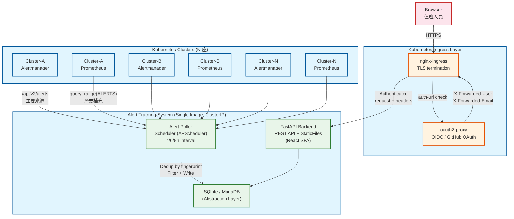
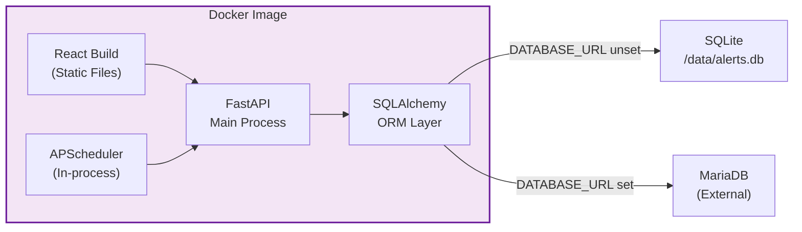
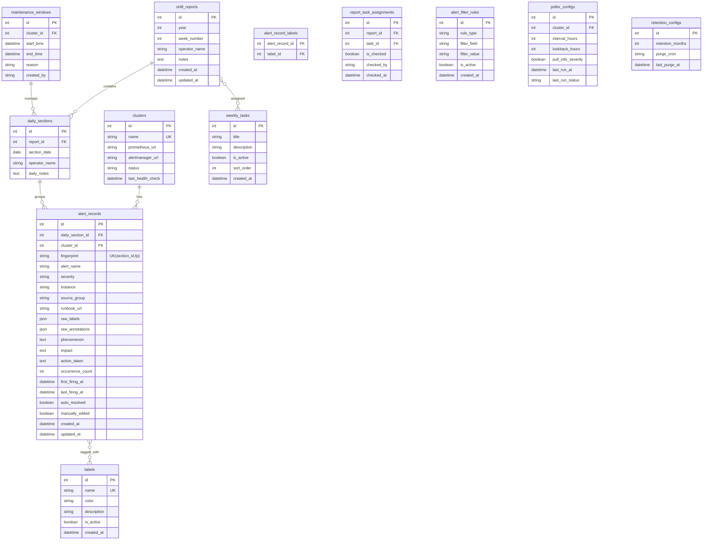
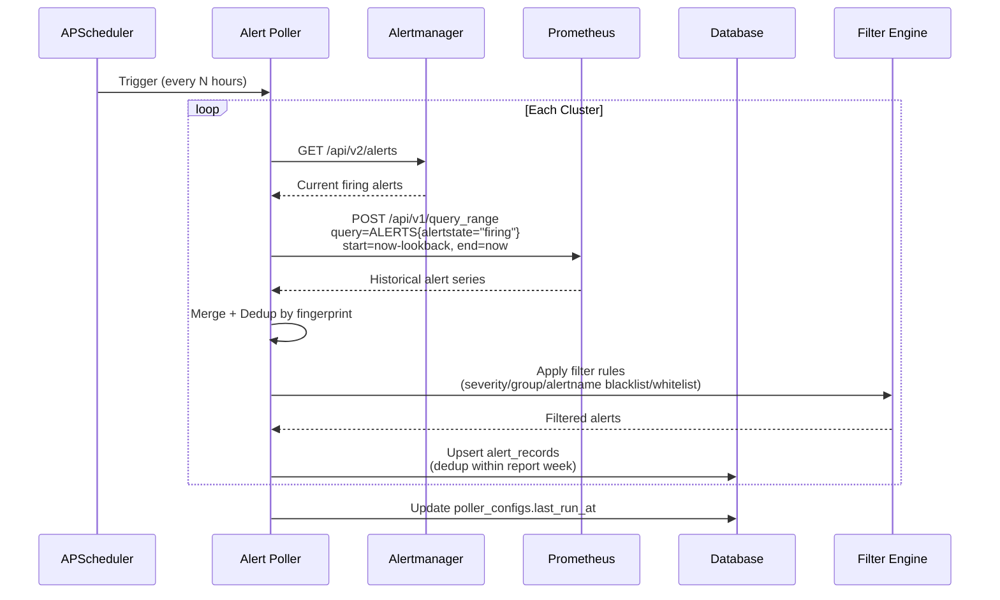

# 架構設計文件 — SRE Alert Tracking System

> **版本：** v1.1.1
> **相關文件：** [CLAUDE.md](../CLAUDE.md) | [README.md](../README.md)

---

## 1. 專案概覽

團隊內部 Alert 追蹤紀錄系統。自動從多座 Kubernetes cluster 的 Prometheus / Alertmanager 拉取 alert 資料，提供值班人員填寫處理紀錄、週報管理、趨勢分析與匯出功能。

**核心痛點：** Alert 風暴期間人工統計紀錄造成值班疲勞；處理紀錄分散無結構化資料，難以回溯與改善。

**技術棧：** Python FastAPI + React + TailwindCSS + SQLite/MariaDB，單一 Docker image 部署於 Kubernetes。

---

## 2. 系統架構

### 2.1 資料流架構



> **安全要點：** oauth2-proxy 位於 Ingress 層，保護所有進入 Service 的流量（包括 React 靜態頁面與 API）。App Service 為 `ClusterIP`，無法從 Ingress 以外直接存取。

### 2.2 元件架構（單一 Image 內部）



---

## 3. 資料模型

### 3.1 ER 關係圖



### 3.2 關鍵 Table 說明

| Table | 用途 | 關鍵設計 |
|-------|------|----------|
| `clusters` | 監控來源清單 | 啟動時從 `clusters.yaml` 同步；每次拉取做 health check 更新 `status` |
| `shift_reports` | 週報框架 | 每週一 00:00（display timezone）自動生成（APScheduler）；`operator_name` 可每日換人 |
| `daily_sections` | 每日分群 | 自動在拉取時建立；`operator_name` 繼承 report 但可覆寫（臨時換班） |
| `alert_records` | Alert 紀錄核心 | `fingerprint` 為 dedup key；同週期內相同 fingerprint 只更新計數；`raw_labels`/`raw_annotations` 保留完整 Prometheus 原始資料；INSERT 時自動映射 `annotations.summary` → `phenomenon`、`annotations.description` → `impact` |
| `labels` | 自訂標籤 | 管理員可合併/標準化；前端 autocomplete |
| `weekly_tasks` | 動態值班任務 | 管理員設定，綁定至每週報表；checkbox 勾選 |
| `alert_filter_rules` | 黑白名單 | `rule_type`: `whitelist`/`blacklist`；`filter_field`: `alertname`/`group`/`severity` |
| `maintenance_windows` | 維護窗口標註 | 統計時排除這些時段的 alert；手動建立 |
| `poller_configs` | 拉取排程設定 | per-cluster 可獨立設定 interval 與 lookback |
| `retention_configs` | 資料保留策略 | 半年或一年；purge cron 可自訂；支援手動觸發 |

### 3.3 Dedup 邏輯（收斂機制）

```
拉取週期: T
新 alert 進入 → 計算 (fingerprint, report_week)

IF 同 (fingerprint, report_week) 已存在:
    UPDATE occurrence_count += 1
    UPDATE last_firing_at = max(existing, new)
    UPDATE auto_resolved = (current state == resolved)
ELSE:
    INSERT 新紀錄
    occurrence_count = 1
```

**DB 層級防禦：** `alert_records` 表設有 `UniqueConstraint("daily_section_id", "fingerprint")`。ORM 層以 `with_for_update()` 做 SELECT-FOR-UPDATE 避免 race condition，UniqueConstraint 作為最終防線——即使 ORM 層被繞過，DB 也會拒絕重複插入（IntegrityError）。

**Fingerprint 來源優先序：**
1. Alertmanager API 回傳的 `fingerprint` 欄位（優先）
2. 若從 Prometheus query_range 取得，用 `hashlib.sha256(sorted(label_set))` 計算

---

## 4. API 設計

### 4.1 API 端點總覽

API-first 設計，所有前端操作均透過 REST API。FastAPI 自動生成 OpenAPI/Swagger 文件。

| 分類 | Method | Path | 說明 |
|------|--------|------|------|
| **Reports** | GET | `/api/reports` | 列出報表（分頁，可篩 year/week） |
| | GET | `/api/reports/{id}` | 報表明細（含 daily_sections + alert_records） |
| | POST | `/api/reports` | 手動建立報表（通常自動） |
| | PATCH | `/api/reports/{id}` | 更新報表（operator_name, notes） |
| **Daily Sections** | PATCH | `/api/sections/{id}` | 更新每日區段（operator_name, notes） |
| **Alert Records** | GET | `/api/alerts` | 列出 alerts（分頁，可篩 cluster/severity/label/week/daterange） |
| | GET | `/api/alerts/{id}` | 單筆 alert 明細 |
| | PATCH | `/api/alerts/{id}` | 更新 alert 紀錄（phenomenon/impact/action_taken/手動覆寫欄位） |
| | GET | `/api/alerts/{id}/history` | 歷史比對（fingerprint-first + alert_name fallback） |
| | POST | `/api/alerts/{id}/suggest` | AI 處理建議（需 LLM 啟用，否則 501） |
| | POST | `/api/alerts/{id}/labels` | 為 alert 加 label |
| | DELETE | `/api/alerts/{id}/labels/{label_id}` | 移除 alert 的 label |
| **Labels** | GET | `/api/labels` | 列出所有 labels |
| | POST | `/api/labels` | 建立新 label |
| | PATCH | `/api/labels/{id}` | 更新 label（管理員） |
| | POST | `/api/labels/merge` | 合併 labels（管理員） |
| | DELETE | `/api/labels/{id}` | 停用 label（軟刪除） |
| **Weekly Tasks** | GET | `/api/tasks` | 列出任務定義 |
| | POST | `/api/tasks` | 建立新任務（管理員） |
| | PATCH | `/api/tasks/{id}` | 更新/停用任務 |
| | PATCH | `/api/reports/{id}/tasks/{task_id}` | 勾選/取消勾選 |
| **Clusters** | GET | `/api/clusters` | 列出 clusters + 健康狀態 |
| | POST | `/api/clusters/health-check` | 手動觸發全部 health check |
| **Filters** | GET | `/api/filters` | 列出黑白名單規則 |
| | POST | `/api/filters` | 建立過濾規則 |
| | DELETE | `/api/filters/{id}` | 刪除過濾規則 |
| **Maintenance** | GET | `/api/maintenance` | 列出維護窗口 |
| | POST | `/api/maintenance` | 建立維護窗口 |
| | PATCH | `/api/maintenance/{id}` | 更新維護窗口 |
| | DELETE | `/api/maintenance/{id}` | 刪除維護窗口 |
| **Export** | GET | `/api/export/report/{id}?format=csv\|json\|md` | 匯出單週報表 |
| | GET | `/api/export/alerts` | 匯出篩選結果（CSV） |
| **Dashboard** | GET | `/api/dashboard/trends` | Alert 趨勢統計（per-cluster, per-week） |
| | GET | `/api/dashboard/top-alerts` | Top-N 最頻繁 alert |
| | GET | `/api/dashboard/severity-distribution` | Severity 分布統計 |
| | GET | `/api/dashboard/correlation` | Alert 關聯分析（sweep-line overlap） |
| **Poller** | GET | `/api/poller/status` | 拉取排程狀態 |
| | POST | `/api/poller/trigger` | 手動觸發拉取 |
| **Admin** | POST | `/api/admin/purge` | 手動觸發 retention purge |
| | GET | `/api/admin/retention` | 查看 retention 設定 |
| | PATCH | `/api/admin/retention` | 更新 retention 設定 |
| **Auth** | GET | `/api/me` | 當前使用者資訊 |
| **Health** | GET | `/api/health` | 健康檢查 + feature flags |
| **Test (Lab)** | POST | `/api/test/seed` | 建立測試資料（僅 `AT_AUTH_MODE=none`） |

### 4.2 認證 Middleware

```python
# AUTH_MODE=oauth2-proxy (production)
# 讀取 X-Forwarded-User / X-Forwarded-Email header
# 注入 request.state.user

# AUTH_MODE=none (lab)
# 跳過認證，request.state.user = "dev-user"
```

**安全要求：** K8s 部署時 Service `type: ClusterIP`，確保只有 Ingress / oauth2-proxy 能打進來。

### 4.3 Admin 端點權限

`/api/admin/*` 端點受 `require_admin` dependency 保護。`AT_ADMIN_USERS` 環境變數指定允許存取的使用者清單（逗號分隔）。空值表示所有認證用戶皆可存取。Lab mode (`AT_AUTH_MODE=none`) 跳過檢查。

### 4.4 Cluster URL 安全驗證

`clusters.yaml` 載入時，所有 `prometheus_url` 和 `alertmanager_url` 經過 `validate_cluster_url()` 驗證：

- 僅允許 `http` / `https` scheme
- 封鎖 AWS metadata (`169.254.169.254`)、GCP metadata (`metadata.google.internal`)、Azure metadata (`100.100.100.200`)
- 封鎖 link-local 位址 (`169.254.*`)

### 4.5 OpenAPI 生產環境隱藏

`AT_OPENAPI_ENABLED=false` 可隱藏 `/docs`、`/redoc`、`/openapi.json`，減少 production 攻擊面。

---

## 5. Alert Poller 設計

### 5.1 拉取流程



### 5.2 拉取配置

| 參數 | 預設值 | 說明 | 設定方式 |
|------|--------|------|----------|
| `interval_hours` | 8 | 拉取間隔 | 環境變數 / DB / 前端 |
| `lookback_hours` | 12 | 回溯時間窗口 | 環境變數 / DB / 前端 |
| `pull_info` | `false` | 是否拉取 info severity | per-cluster 可獨立設定 |
| `severity_filter` | `["critical", "warning"]` | 預設拉取等級 | Filter rules |

**刻意重疊設計：** interval=8h, lookback=12h → 相鄰拉取重疊 4h。用 fingerprint dedup 確保不重複寫入，但不漏掉短暫 flapping alerts。

### 5.3 過濾規則引擎

```
filter_rules 表：
┌──────────────────────────────────────────────────┐
│ rule_type  │ filter_field │ filter_value          │
├──────────────────────────────────────────────────┤
│ blacklist  │ alertname    │ Watchdog              │ ← 排除 heartbeat alert
│ blacklist  │ group        │ info-alerts           │ ← 排除整個 group
│ whitelist  │ alertname    │ MariaDB*              │ ← 只拉 MariaDB 相關
│ blacklist  │ severity     │ info                  │ ← 預設排除 info
└──────────────────────────────────────────────────┘

評估順序：
1. 若存在任何 whitelist 規則 → 只保留符合 whitelist 的 alert
2. 對保留的 alert 再套用 blacklist 排除
3. 無任何規則 → 全部保留（僅受 severity_filter 約束）
```

---

## 6. 前端頁面設計

### 6.1 頁面結構

| 頁面 | 路由 | 功能 |
|------|------|------|
| **週報列表** | `/` | 按年/週列出所有報表，顯示 alert 總數、填寫進度 |
| **週報明細** | `/reports/:id` | 每日分群 → alert 卡片列表 + 任務 checkbox + operator |
| **Alert 明細** | `/alerts/:id` | 自動欄位（唯讀，逃生門解鎖）+ 手動欄位 textarea + label tag input |
| **歷史查詢** | `/search` | 按 label / cluster / severity / 周次 / 日期範圍 篩選 |
| **趨勢儀表板** | `/dashboard` | 每週 alert 數量折線圖、Top-N alertname 排行、per-cluster 分布 |
| **設定** | `/settings` | Clusters 狀態燈號 + 過濾規則管理 + 任務管理 + Label 管理 + Retention + Poller 設定 |

### 6.2 週報明細頁面佈局

```
┌─────────────────────────────────────────────────┐
│  Week 2026-W11  │  Operator: [poyu ▼]  │ Export │
├─────────────────────────────────────────────────┤
│  □ 每週任務 1: 檢查備份完整性                    │
│  □ 每週任務 2: 確認 certificate 有效期            │
│  □ 每週任務 3: ...                               │
├─────────────────────────────────────────────────┤
│  ▼ 2026-03-09 (Mon) — Operator: poyu   [3 alerts]│
│  ┌─────────────────────────────────────────────┐ │
│  │ 🔴 MariaDBHighConnections                   │ │
│  │ Cluster: prod-a │ Instance: db-01:9104       │ │
│  │ Count: 12 │ First: 08:15 │ Last: 14:30      │ │
│  │ Labels: [database] [capacity]                │ │
│  │ ─────────────────────────────────────────── │ │
│  │ 現象: [textarea]                             │ │
│  │ 影響: [textarea]                             │ │
│  │ 處理作法: [textarea]                          │ │
│  └─────────────────────────────────────────────┘ │
│  ┌─────────────────────────────────────────────┐ │
│  │ 🟡 PodContainerHighCPU                      │ │
│  │ ...                                          │ │
│  └─────────────────────────────────────────────┘ │
│                                                  │
│  ▼ 2026-03-10 (Tue) — Operator: poyu   [1 alert] │
│  ...                                             │
├─────────────────────────────────────────────────┤
│  ▼ 2026-03-11 (Wed) — Operator: john   [臨時換班]│
│  ...                                             │
└─────────────────────────────────────────────────┘
```

### 6.3 Alert 顯示上限

週報明細頁一次載入最多 **500 筆** alert（API `limit=500`）。達到上限時前端顯示黃色截斷警告，引導使用者透過 CSV 匯出查看完整紀錄或縮小查詢範圍。此限制是為了避免 DOM 節點過多導致瀏覽器卡頓（500 張 AlertCard 含 textarea 已是效能邊界）。

### 6.4 Alert 自動/手動欄位設計

| 欄位 | 來源 | 預設狀態 | 逃生門 |
|------|------|---------|--------|
| Alert Name | Alertmanager `alertname` label | 唯讀 | 點擊 ✏️ 圖示解鎖編輯 |
| Severity | Alertmanager `severity` label | 唯讀 | 同上 |
| Cluster | `clusters.yaml` 對應 | 唯讀 | 同上 |
| Instance | Alertmanager labels/annotations | 唯讀 | 同上 |
| Runbook URL | Alertmanager `runbook_url` annotation | 唯讀（超連結） | 同上 |
| Raw Labels | Alertmanager/Prometheus 全部 labels | 唯讀 JSON (collapsible) | — |
| Raw Annotations | Alertmanager annotations | 唯讀 JSON (collapsible) | — |
| 現象 | 自動填入 `annotations.summary`；可人工覆寫 | textarea（有預填值時顯示灰底） | 直接編輯 |
| 影響 | 自動填入 `annotations.description`；可人工覆寫 | textarea（有預填值時顯示灰底） | 直接編輯 |
| 處理作法 | 人工填寫 | 空白 textarea | 直接編輯 |
| Labels | 人工選擇/建立 | 空白 tag input (autocomplete) | 直接操作 |

**手動覆寫追蹤：** 任何自動欄位被手動修改時，`manually_edited` flag 設為 `true`，UI 上顯示小標記提示此欄位已被人工調整。

---

## 7. 匯出功能

### 7.1 PDF（瀏覽器列印）

前端提供「列印版」按鈕，切換至 `@media print` 優化的 CSS layout：隱藏導覽列、展開所有摺疊區段、適合 A4 橫向。使用者直接 `Ctrl+P` 匯出。零後端開發成本。

### 7.2 CSV/JSON/Markdown（後端 API）

| Endpoint | 範圍 | 格式 |
|----------|------|------|
| `GET /api/export/report/{id}?format=csv` | 單週報表 | CSV |
| `GET /api/export/report/{id}?format=json` | 單週報表 | JSON |
| `GET /api/export/report/{id}?format=md` | 單週報表 | Markdown |
| `GET /api/export/alerts?label=X&week=Y&format=csv` | 篩選結果（跨週） | CSV |

CSV 欄位：`week, date, alert_name, severity, cluster, instance, occurrence_count, first_firing_at, last_firing_at, phenomenon, impact, action_taken, labels`

Markdown 格式：以週報為單位，按日期分群，每個 alert 含 severity icon、metadata、labels、處理紀錄。時間戳自動轉換為 `AT_DISPLAY_TIMEZONE` 顯示。

---

## 8. 趨勢儀表板

### 8.1 統計查詢

| 圖表 | API | 說明 |
|------|-----|------|
| 每週 Alert 數量折線 | `GET /api/dashboard/trends?range=12w` | 按 cluster 分色，X 軸=週次 |
| Top-10 最頻繁 Alert | `GET /api/dashboard/top-alerts?range=4w` | 柱狀圖，按 alertname 聚合 |
| Severity 分布 | `GET /api/dashboard/severity-distribution` | 圓餅圖，按 severity 聚合 |
| Alert 關聯分析 | `GET /api/dashboard/correlation?year=N&week=N` | Sweep-line overlap，同時段重疊群組 + mini Gantt timeline |
| 維護窗口標註 | overlay | 在折線圖上以灰色區塊標示維護窗口，hover 顯示 reason |

### 8.2 維護窗口排除

統計數據預設**包含**維護窗口期間的 alert，但提供 toggle 可切換為排除模式。排除邏輯：若 alert 的 `first_firing_at` 落在某 `maintenance_window` 的 `[start_time, end_time]` 區間內，則從統計中移除。

---

## 9. 部署架構

> 完整部署步驟（含 Testing vs Production 差異）請參考 **[K8s 部署指南](deployment-guide.md)**。

### 9.1 部署模式

| 環境 | 認證 | 資料庫 | Poller | 安全 |
|------|------|--------|--------|------|
| Lab | `AT_AUTH_MODE=none` | SQLite (local) | 1h/2h | 無 |
| Testing | `AT_AUTH_MODE=none` | SQLite (PVC) | 4h/6h | 建議 |
| Production | `AT_AUTH_MODE=oauth2-proxy` | SQLite (PVC) 或 MariaDB | 8h/12h | 必須 |

### 9.2 Kubernetes 資源

K8s manifests 位於 `k8s/` 目錄：

| 資源 | 檔案 | 說明 |
|------|------|------|
| Deployment | `deployment.yaml` | Alembic init-container + security hardening |
| Service | `service.yaml` | ClusterIP (only behind oauth2-proxy) |
| PVC | `pvc.yaml` | SQLite 資料持久化 (1Gi) |
| ConfigMap | `configmap.yaml` | Cluster 清單 (clusters.yaml) |
| Ingress | `ingress.yaml` | TLS + oauth2-proxy annotations |

**Security 特性（已內建於 deployment.yaml）：** Recreate strategy、`runAsNonRoot`、`readOnlyRootFilesystem`、`drop ALL` capabilities、liveness/readiness/startup probes、emptyDir /tmp。

### 9.3 環境變數

所有環境變數使用 `AT_` 前綴：

| 變數 | 預設值 | 說明 |
|------|--------|------|
| `AT_AUTH_MODE` | `oauth2-proxy` | `none` 關閉認證 (Lab/Testing) |
| `AT_DATABASE_URL` | (空) | 空=SQLite; `mysql+pymysql://...`=MariaDB |
| `AT_DATA_DIR` | `/data` | SQLite 資料目錄 |
| `AT_CONFIG_DIR` | `/app/config` | clusters.yaml 目錄 |
| `AT_DISPLAY_TIMEZONE` | `Asia/Taipei` | IANA 時區名稱，影響介面顯示與週報交接日期（DB 一律存 UTC） |
| `AT_POLLER_INTERVAL_HOURS` | `8` | 拉取間隔 |
| `AT_POLLER_LOOKBACK_HOURS` | `12` | 回溯窗口 |
| `AT_LLM_PROVIDER` | `none` | LLM 供應商（`openai-compatible` 啟用 AIOps 建議） |
| `AT_LLM_API_BASE` | `https://api.openai.com/v1` | OpenAI-compatible API base URL |
| `AT_LLM_API_KEY` | (空) | LLM API key |
| `AT_LLM_MODEL` | `gpt-4o-mini` | LLM 模型名稱 |
| `AT_ADMIN_USERS` | (空) | 允許存取 admin API 的使用者清單（逗號分隔），空=所有認證用戶 |
| `AT_OPENAPI_ENABLED` | `true` | 是否啟用 `/docs`、`/openapi.json`（production 建議關閉） |

### 9.4 Docker Multi-stage Build

```dockerfile
# Stage 1: Frontend build (Node 20)
FROM node:20-alpine AS frontend
COPY frontend/ ./
RUN npm ci && npm run build

# Stage 2: Backend + Frontend static (Python 3.12)
FROM python:3.12-slim
COPY backend/ ./
COPY --from=frontend /app/frontend/dist ./static
# non-root user, HEALTHCHECK, readOnlyRootFilesystem-ready
CMD ["uvicorn", "main:app", "--host", "0.0.0.0", "--port", "8000"]
```

---

## 10. 設定檔結構 (clusters.yaml)

```yaml
clusters:
  - name: prod-cluster-a
    prometheus_url: http://prometheus.monitoring.svc:9090
    alertmanager_url: http://alertmanager.monitoring.svc:9093
    # Optional per-cluster overrides
    interval_hours: 4          # 覆寫全域預設
    pull_info: false
    instance_label: "instance"  # 指定 instance 來源 label

  - name: prod-cluster-b
    prometheus_url: http://prometheus.monitoring-b.svc:9090
    alertmanager_url: http://alertmanager.monitoring-b.svc:9093

  - name: staging
    prometheus_url: http://prometheus.monitoring.svc:9090
    alertmanager_url: http://alertmanager.monitoring.svc:9093
    pull_info: true            # staging 環境也拉 info
```

**啟動行為：** 系統啟動時讀取 `clusters.yaml`，與 DB `clusters` 表做 sync（新增/更新/標記移除）。不刪除 DB 中已移除的 cluster（避免歷史紀錄斷裂），僅標記 `status=removed`。

---

## 11. Lab 開發環境

### 11.1 docker-compose.yml

```yaml
services:
  app:
    build: .
    ports:
      - "8000:8000"
    environment:
      AT_AUTH_MODE: "none"
      AT_DATABASE_URL: ""
      AT_POLLER_INTERVAL_HOURS: "1"      # Lab 環境加速
      AT_POLLER_LOOKBACK_HOURS: "2"
    volumes:
      - ./data:/data
      - ./config:/app/config
    depends_on:
      - fake-prometheus
      - fake-alertmanager

  fake-prometheus:
    image: prom/prometheus:v2.51.0
    ports:
      - "9090:9090"
    volumes:
      - ./lab/prometheus.yml:/etc/prometheus/prometheus.yml
      - ./lab/alert-rules.yml:/etc/prometheus/rules/alert-rules.yml

  fake-alertmanager:
    image: prom/alertmanager:v0.27.0
    ports:
      - "9093:9093"
    volumes:
      - ./lab/alertmanager.yml:/etc/alertmanager/alertmanager.yml

  # Optional: MariaDB for testing external DB mode
  mariadb:
    image: mariadb:11.2
    ports:
      - "3306:3306"
    environment:
      MARIADB_ROOT_PASSWORD: devpass
      MARIADB_DATABASE: alert_tracker
    profiles:
      - mariadb
```

### 11.2 Fake Alert 產生

`lab/alert-rules.yml` 預載持續 firing 的假 alert：

```yaml
groups:
  - name: fake-alerts
    rules:
      - alert: FakeMariaDBHighConnections
        expr: vector(1)
        labels:
          severity: warning
          cluster: lab-cluster
          instance: "db-01:9104"
        annotations:
          summary: "[LAB] Fake high connections"
          runbook_url: "https://wiki.example.com/runbooks/mariadb-connections"
      - alert: FakePodHighCPU
        expr: vector(1)
        labels:
          severity: critical
          cluster: lab-cluster
          instance: "pod-web-abc123"
        annotations:
          summary: "[LAB] Fake high CPU"
```

---

## 12. 專案目錄結構

```
sre-alert-tracker/
├── backend/
│   ├── main.py                    # FastAPI entry point + StaticFiles mount
│   ├── config.py                  # Settings (env vars + clusters.yaml)
│   ├── database.py                # SQLAlchemy engine + session factory
│   ├── models/                    # ORM models
│   │   ├── cluster.py
│   │   ├── shift_report.py
│   │   ├── daily_section.py
│   │   ├── alert_record.py
│   │   ├── label.py
│   │   ├── weekly_task.py
│   │   ├── maintenance_window.py
│   │   ├── filter_rule.py
│   │   ├── poller_config.py
│   │   └── retention_config.py
│   ├── routers/                   # API route handlers
│   │   ├── reports.py
│   │   ├── alerts.py
│   │   ├── labels.py
│   │   ├── tasks.py
│   │   ├── clusters.py
│   │   ├── filters.py
│   │   ├── maintenance.py
│   │   ├── export.py
│   │   ├── dashboard.py
│   │   ├── poller.py
│   │   ├── admin.py
│   │   └── test_seed.py          # Lab-only seed endpoint
│   ├── services/                  # Business logic
│   │   ├── alert_poller.py        # Dual-engine pull + dedup + filter
│   │   ├── alert_query.py         # Shared alert filter builder (DRY)
│   │   ├── dedup.py               # Fingerprint computation + upsert
│   │   ├── filter_engine.py       # Whitelist/blacklist evaluation
│   │   ├── report_generator.py    # Weekly report auto-creation
│   │   ├── retention_manager.py   # Data purge scheduler
│   │   ├── cluster_health.py      # Health check logic
│   │   ├── export_service.py      # CSV/JSON/Markdown generation
│   │   ├── timezone_utils.py      # UTC ↔ display timezone conversion
│   │   └── llm_service.py         # AIOps LLM suggestion (optional)
│   ├── middleware/
│   │   └── auth.py                # oauth2-proxy header extraction
│   ├── schemas/                   # Pydantic request/response models
│   │   └── ...
│   ├── requirements.txt
│   └── alembic/                   # DB migration (optional)
│       └── versions/
├── frontend/
│   ├── src/
│   │   ├── App.jsx
│   │   ├── constants.js              # Shared severity colors, chart palette
│   │   ├── pages/
│   │   │   ├── ReportList.jsx
│   │   │   ├── ReportDetail.jsx
│   │   │   ├── AlertDetail.jsx
│   │   │   ├── Search.jsx
│   │   │   ├── Dashboard.jsx
│   │   │   └── Settings.jsx
│   │   ├── components/
│   │   │   ├── AlertCard.jsx
│   │   │   ├── CorrelationSection.jsx
│   │   │   ├── ErrorBoundary.jsx
│   │   │   ├── ExportButton.jsx
│   │   │   ├── LabelTag.jsx
│   │   │   ├── LabelTagInput.jsx
│   │   │   ├── Navbar.jsx
│   │   │   └── SeverityBadge.jsx
│   │   └── api/
│   │       └── client.js          # Axios/fetch wrapper
│   ├── package.json
│   ├── vite.config.js
│   └── tailwind.config.js
├── config/
│   └── clusters.yaml              # Cluster 清單模板
├── lab/
│   ├── prometheus.yml
│   ├── alertmanager.yml
│   └── alert-rules.yml            # Fake alerts for dev
├── k8s/
│   ├── deployment.yaml
│   ├── service.yaml
│   ├── configmap.yaml
│   ├── pvc.yaml
│   └── ingress.yaml               # (搭配 oauth2-proxy)
├── docker-compose.yml
├── Dockerfile
├── Makefile
├── CLAUDE.md
├── README.md
└── CHANGELOG.md
```

---

## 13. 關鍵設計決策

| # | 決策 | 理由 | 替代方案與取捨 |
|---|------|------|---------------|
| 1 | SQLite 為預設 DB | 零運維、單檔部署、PVC 掛載即可。alert 紀錄量級（每週數百筆）SQLite 游刃有餘 | MariaDB 可選，透過 DATABASE_URL 切換 |
| 2 | 雙引擎拉取（AM + PM） | Alertmanager 資料乾淨但有盲區；Prometheus query_range 補歷史避免漏短暫 alert | 單拉 AM 更簡單但會漏 flapping alerts |
| 3 | Fingerprint 為 dedup key | 精確到 label set 層級，比粗粒度的 (alertname, cluster, instance) 更準確 | 粗粒度 dedup 會把不同問題合併 |
| 4 | 單一 Docker image | 降低 K8s 部署複雜度，一個 Deployment 搞定 | 前後端分離需多個 Deployment + Nginx |
| 5 | APScheduler in-process | 不需額外 CronJob 或 Celery；**必須單 replica**（見下方說明） | K8s CronJob 更 cloud-native 但增加元件 |
| 6 | oauth2-proxy header 信任 | 不重複實作登入邏輯；Service ClusterIP 確保 header 不可偽造 | 自建 JWT auth 增加複雜度 |
| 7 | 每週一自動生成報表 | 減少人工操作；空白框架不佔資源 | 手動建立更彈性但容易遺忘 |
| 8 | Label 多對多關聯 | 支援多 label 分類，跨週查詢彈性高 | 直接在 alert_record 存 JSON array 更簡單但查詢效能差 |
| 9 | 不動 M4M 職責 | M4M 越簡單越可靠；追蹤系統獨立維護 cluster 清單，拉取時順帶 health check | 中央化清單更 SSOT 但增加 M4M 複雜度 |
| 10 | 自建而非採用開源 | 現有工具（Keep/OneUptime/Alerta）不涵蓋值班紀錄+週報管理的核心需求；硬改比新建更慢 | 基於 Keep 擴展功能更多但維護負擔重 |

> **⚠️ 多 Replica 限制：** 本系統**嚴禁多 replica 部署**，原因有二：
> 1. **APScheduler in-process** — 每個 replica 都會獨立觸發排程任務（alert 拉取、週報生成），造成重複寫入。雖然 fingerprint dedup + UniqueConstraint 可防止重複 alert，但 occurrence_count 會被多 replica 各自累加，導致計數不準。
> 2. **SQLite 並發寫入** — SQLite 僅支援單 writer，多 replica 同時寫入會觸發 `database is locked` 錯誤。即使切換到 MariaDB 也無法解決 APScheduler 重複執行問題。
>
> 若未來需要 HA，需改用外部排程（K8s CronJob + leader election）或分散式鎖（Redis / DB advisory lock）。Deployment strategy 已設為 `Recreate` 確保 rolling update 時不會短暫存在兩個 replica。

---

## 14. 未來擴展方向

| 優先級 | 功能 | 說明 |
|--------|------|------|
| P1 | Slack/Teams 通知整合 | 週報生成時自動推送摘要到頻道 |
| P1 | 值班人員自動帶入 | 從 oauth2-proxy header 自動辨識當前使用者 |
| P3 | Webhook 接收模式 | 除了 pull，也支援 Alertmanager webhook push |
